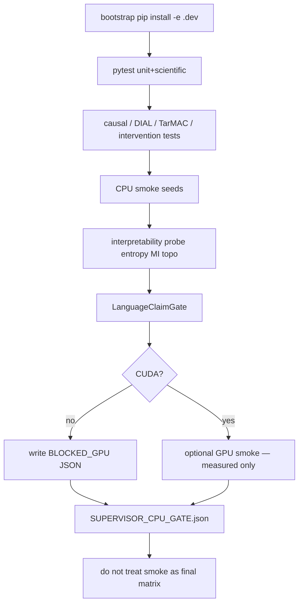

# Activity — experiment / reproduction

```mermaid
flowchart TD
  A[bootstrap pip install -e .dev] --> B[pytest unit+scientific]
  B --> C[causal / DIAL / TarMAC / intervention tests]
  C --> D[CPU smoke seeds]
  D --> E[interpretability probe entropy MI topo]
  E --> F[LanguageClaimGate]
  F --> G{CUDA?}
  G -->|no| H[write BLOCKED_GPU JSON]
  G -->|yes| I[optional GPU smoke — measured only]
  H --> J[SUPERVISOR_CPU_GATE.json]
  I --> J
  J --> K[do not treat smoke as final matrix]
```

Ablations, generalization, and final 5-seed matrices live under `results/` and are cited only when their `STATUS.json` exists.
