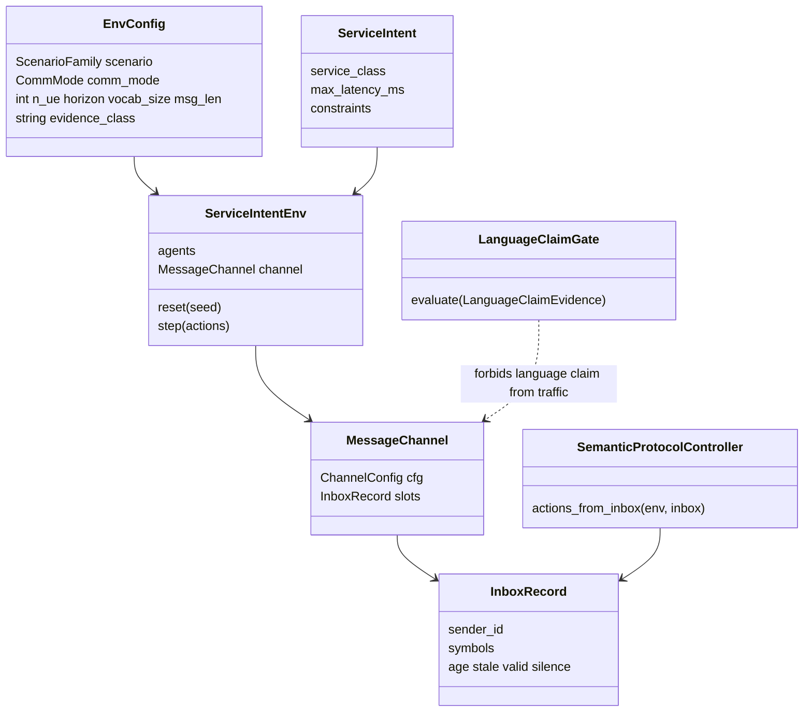

# Class — agent / environment

```mermaid
classDiagram
  class EnvConfig {
    ScenarioFamily scenario
    CommMode comm_mode
    int n_ue horizon vocab_size msg_len
    string evidence_class
  }
  class ServiceIntentEnv {
    agents
    MessageChannel channel
    reset(seed)
    step(actions)
  }
  class MessageChannel {
    ChannelConfig cfg
    InboxRecord slots
  }
  class InboxRecord {
    sender_id
    symbols
    age stale valid silence
  }
  class ServiceIntent {
    service_class
    max_latency_ms
    constraints
  }
  class SemanticProtocolController {
    actions_from_inbox(env, inbox)
  }
  class LanguageClaimGate {
    evaluate(LanguageClaimEvidence)
  }
  EnvConfig --> ServiceIntentEnv
  ServiceIntentEnv --> MessageChannel
  MessageChannel --> InboxRecord
  ServiceIntent --> ServiceIntentEnv
  SemanticProtocolController --> InboxRecord
  LanguageClaimGate ..> MessageChannel : forbids language claim from traffic
```
