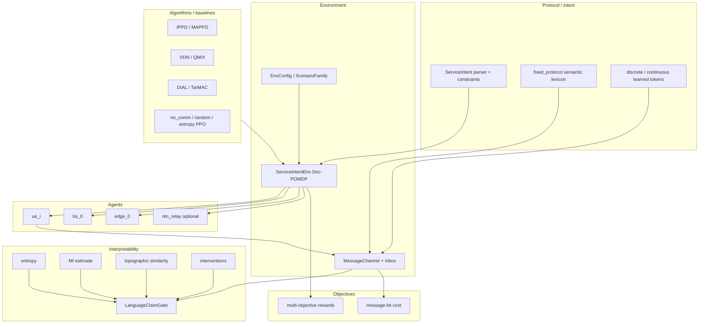

# Component — current

```mermaid
flowchart TB
  subgraph env [Environment]
    CFG[EnvConfig / ScenarioFamily]
    WIRE[ServiceIntentEnv Doc-POMDP]
    CH[MessageChannel + inbox]
  end
  subgraph agents [Agents]
    UE[ue_i]
    BS[bs_0]
    EDGE[edge_0]
    NTN[ntn_relay optional]
  end
  subgraph proto [Protocol / intent]
    INT[ServiceIntent parser + constraints]
    FIX[fixed_protocol semantic lexicon]
    LEARN[discrete / continuous learned tokens]
  end
  subgraph obj [Objectives]
    REW[multi-objective rewards]
    BITS[message bit cost]
  end
  subgraph interp [Interpretability]
    H[entropy]
    MI[MI estimate]
    TOPO[topographic similarity]
    IV[interventions]
    GATE[LanguageClaimGate]
  end
  subgraph train [Algorithms / baselines]
    IPPO[IPPO / MAPPO]
    VDN[VDN / QMIX]
    DIAL[DIAL / TarMAC]
    BASE[no_comm / random / entropy PPO]
  end
  CFG --> WIRE
  WIRE --> UE & BS & EDGE & NTN
  UE --> CH
  CH --> GATE
  INT --> WIRE
  FIX --> CH
  LEARN --> CH
  WIRE --> REW
  CH --> BITS
  train --> WIRE
  H --> GATE
  MI --> GATE
  TOPO --> GATE
  IV --> GATE
```

`LanguageClaimGate` never promotes message traffic to an emergent-language result.
