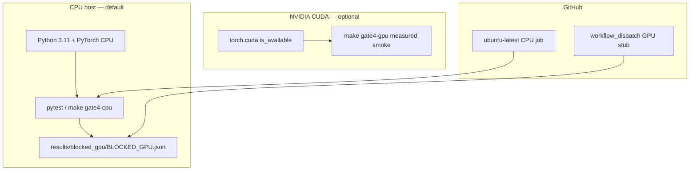

# Deployment — CPU vs GPU

```mermaid
flowchart TB
  subgraph cpu [CPU host — default]
    PY[Python 3.11 + PyTorch CPU]
    TEST[pytest / make gate4-cpu]
    JSON[results/blocked_gpu/BLOCKED_GPU.json]
    PY --> TEST --> JSON
  end
  subgraph gpu [NVIDIA CUDA — optional]
    CU[torch.cuda.is_available]
    SMOKE[make gate4-gpu measured smoke]
    CU --> SMOKE
  end
  subgraph gh [GitHub]
    CI[ubuntu-latest CPU job]
    GPUJOB[workflow_dispatch GPU stub]
    CI --> TEST
    GPUJOB --> JSON
  end
```

Absence of CUDA is a successful honest result (`BLOCKED_GPU`), not a test failure.
