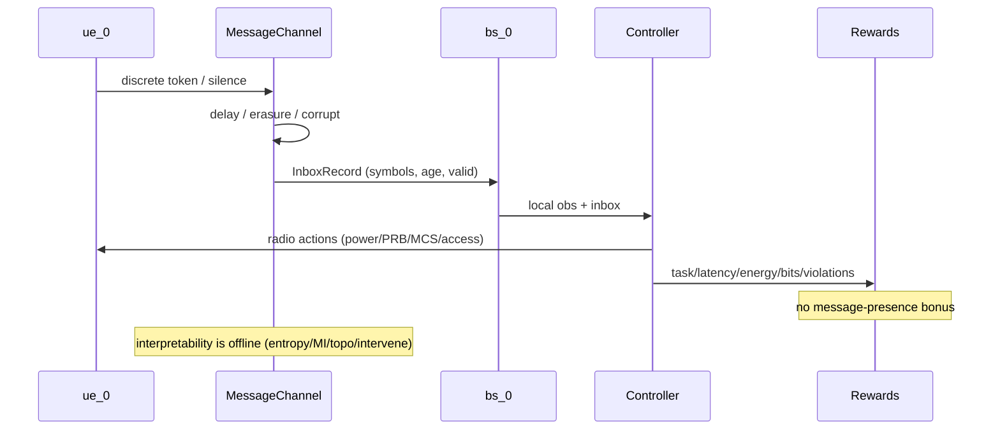

# Sequence — communication

Messages enter the **observation inbox**. They never add a presence bonus to reward.

```mermaid
sequenceDiagram
  participant UE as ue_0
  participant CH as MessageChannel
  participant BS as bs_0
  participant CTL as Controller
  participant R as Rewards
  UE->>CH: discrete token / silence
  CH->>CH: delay / erasure / corrupt
  CH->>BS: InboxRecord (symbols, age, valid)
  BS->>CTL: local obs + inbox
  CTL->>UE: radio actions (power/PRB/MCS/access)
  CTL->>R: task/latency/energy/bits/violations
  Note over R: no message-presence bonus
  Note over CH: interpretability is offline (entropy/MI/topo/intervene)
```
