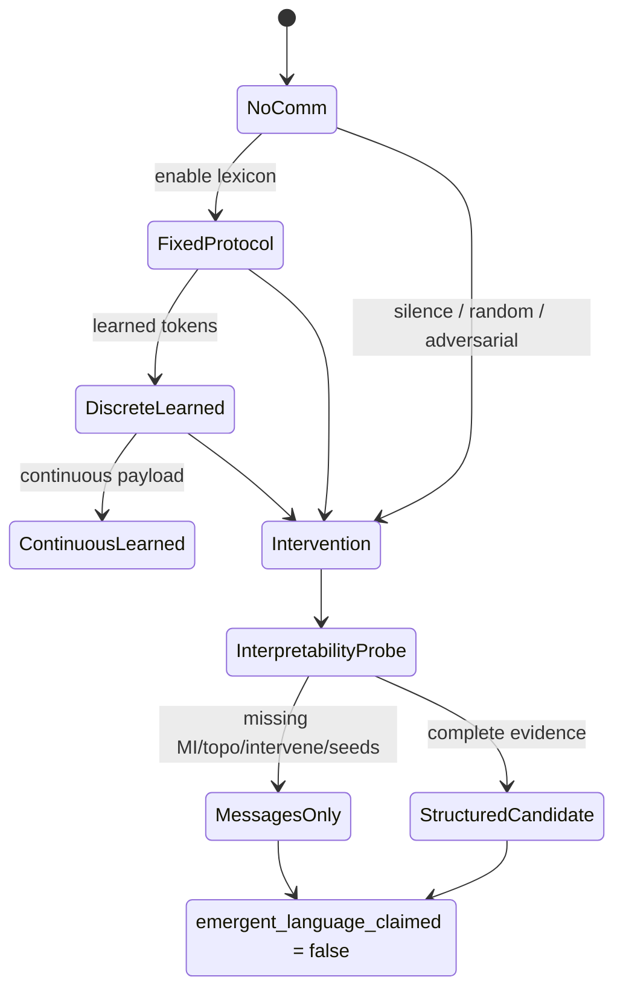

# State — protocol / communication mode

```mermaid
stateDiagram-v2
  [*] --> NoComm
  NoComm --> FixedProtocol: enable lexicon
  FixedProtocol --> DiscreteLearned: learned tokens
  DiscreteLearned --> ContinuousLearned: continuous payload
  NoComm --> Intervention: silence / random / adversarial
  FixedProtocol --> Intervention
  DiscreteLearned --> Intervention
  Intervention --> InterpretabilityProbe
  InterpretabilityProbe --> MessagesOnly: missing MI/topo/intervene/seeds
  InterpretabilityProbe --> StructuredCandidate: complete evidence
  StructuredCandidate --> NotEmergentLanguage
  MessagesOnly --> NotEmergentLanguage
  NotEmergentLanguage: emergent_language_claimed = false
```

Comm modes are `EnvConfig.comm_mode` values. The last two states are claim states, not env modes.
